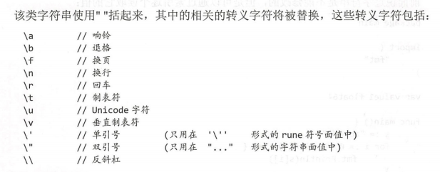
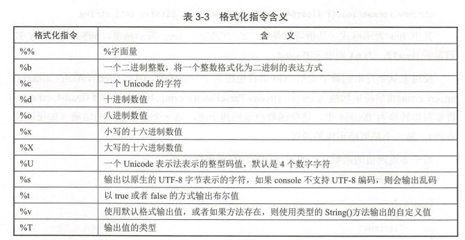

# 一 整形

# 二 浮点数

# 三 字符与字符串
GO中，一个字符串是一个不可改变的UTF-8字符序列，一个ASCII码占用1字节，字符根据需要占用2-4字节。

默认采用UTF-8编码格式进行文件存储。
- 首先可以减少内存的使用，节约硬盘空间
- 统一编码格式有助于减少读取时的编码和解码工作

支持两种形式的字面值
- 1 **解释字符串**
- 
- 2 **非解释字符串**：字符串使用反引号，支持换行
- Demo\string.go

## 1.1 操作字符串
- 通过索引读取：切片与python相同，不能超过索引值，读区间外造成panic异常
- 字符串遍历：两种方式,第一种字不是UTF-8不能遍历，第二种使用range
     ```cgo
        s1 := "我是中国人"
        for i:=0;i < len(s1);i++ {
            fmt.Printf("%d = %v\n",i,s1[i])
        }
        fmt.Println()
        for _,v := range s1{
            fmt.Printf("%c",v)
        }
        fmt.Print("\n")
    ```
- 字符串修改：数据复制到可变变量中
    - 字节修改 []byte
    - 字符串修改 []rune
- strings 包
  - 包括判断：
    - strings.HasPrefix:前缀是否包含指定的字符串
    - strings.HasSuffix：判断后缀是否包含指定子字符串
    - strings.Contains:判断字符串是否包含指定字符串
    - **strings.ContainsAay**:能匹配更广泛的内容，可以匹配Unicode字符
  - 索引：-1表示没有该字符串
    - strings.Index:第一次字符串出现的位置
    - strings.LastIndex:最后一次字符串出现的位置
    - strings.IndexRune：对字符进行定位
  - 替换：基础字符串替换
    - strings.Replace：strings.Replace(str, old, new,n )函数共有4个参数
      - 第一个为原字符串
      - 第二个表示原字符串中需要被替换的子字符串
      - new是替换内容
      - n表示匹配到第几个 old,如果把上面的n改为数-1表示匹配所有。
  - 统计：
    - 出现频率，strings.Count()
    - 字符出现数量:
      - len([]rune(str))
      - utf8.RuneCountInString(str)
  - 大小写转换：Unicode字符全部转换大小写
    - strings.ToLower(s) 
    - strings.ToUpper(s)
  - 修剪：string.Trim(str1,str2),把会str2的每个字符分开去匹配str1,匹配上就删减，开头尾部
  - 分割：strings.Split，返回一个切片slice(list)
  - 插入字符:strings.join(strSli,";") (python join)
- strconv包：字符串与其他类型转换
  - 数字到字符串
    - strconv.Itoa  十进制转化为字符串 
    - strconv.FormatFloat() 64位浮点数转化位字符串
  - 字符串到数字
    - strconv.Atoi(s string)(i int,err error)：字符串到int型
    - strconv.ParseFloat(s string,bitSize int)(f float64, err error)
   
## 1.2 字符串格式化


# 四 布尔值
命名规则建议isSorted,isFinished等。

# 五 基本数据类型扩展
## 1. 强制类型转换
与C类型
## 2. 自定义类型
```cgo
type stu struct{
    Name string
    age int
}
```

## 3. 类型别名
- byte类型实际上是 int8类型的别名
- rune类型实际是 int32类型的别名

```go
type(
    string32 string
)

var b string32 
```
## 4. 指针
指针变量都是一个内存位置，内存位置都有其定义的地址，可以使用&运算符来访问它。
### nil指针
定义的值为零的常量，特殊意义，表示指针不打算指向可访问的存储器位置。
### 指针的指针
**
### 指针数组
a:= []int{10,100,200}

### 传递给函数 跟C类似


