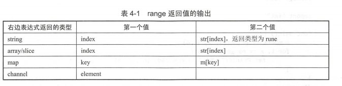

# 流程控制
for,switch

defer-用于捕获异常和资源回收等工作
select-用于多分支选择（配合通道使用）
go-用于异步启动goroutine并执行特定函数

# 一 条件语句 [Demo](./Demo/if-else.go)
大括号称为一个代码块，如一个函数，if语句，每个代码块内部拥有自己的局部变量

if 判断
- if expression
- if  else
- else if expression

初始化子语句
- if可以有一个子语句，用于初始化局部变量 `if a:=10;a<20{}`

 
# 二 选择语句 [Demo](./Demo/switch.go)
## 表达式switch
Demo/switch.go 一个case中可以有多个条件,分割
## 类型switch
针对变量类型判断执行哪个case
### 初始化语句
switch与if一样，可以在开始初始化子语句

## select语句
配合通道（channel）的读写操作，用于多个channel的并发读写操作

select 随机选择一个case来判断，直到匹配其中一个case

select与default避免所有channel同时阻塞

# 三 循环语句 [Demo](./Demo/for.go)
## for
for 有3个子语句
- 初始化子语句
- 条件子语句 （必须）
- 后置子语句

## range
迭代器，轮询字符串，字典，持续读取一个通道类型值中的元素

# 四 延迟语句 [Demo](./Demo/defer.go)
defer **后面的表达式必须是外部函数的调用，且只能出现在函数内使用**
- 只有当defer语句全部执行，**defer所在函数才算真正结束执行**
- 当函数中有defer语句，**等待所有defer语句执行完毕，才会执行return语句**

**作用**：
- defer可用于回收资源，清理收尾等工作，且不用纠结代码在哪里，都是最后执行

**原理**：
- 声明defer函数，会将函数压栈，所以先执行defer会最后执行，最后defer的函数会第一个执行

# 五 标签 [Demo](./Demo/Label.py)
可以给for,swith,select等流程控制代码块打上标签，配合标签标识符可以方便跳转到某一个地方继续执行，有助于提高编程效率

建议大写字母+数字的命名方式，标签可以标记任何语句

Label + break,continue 控制跳出位置

## break Label
见示例

## continue Label
见示例

## goto Label
无条件跳转到相同函数中的带标签语句。