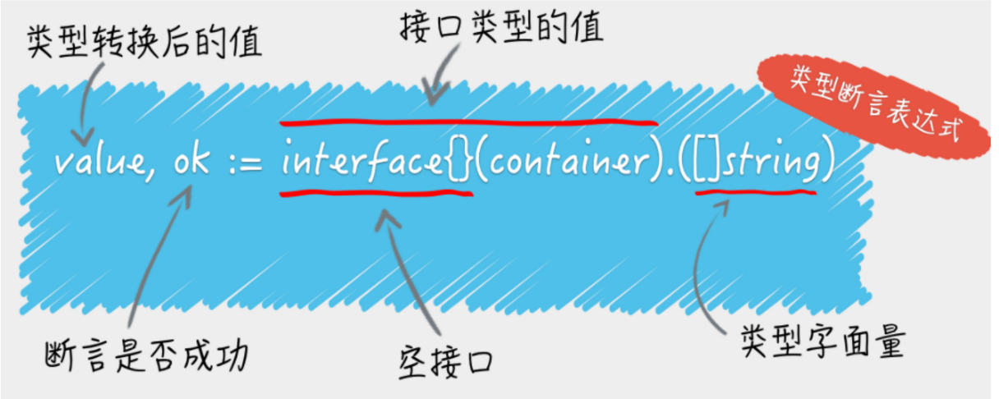
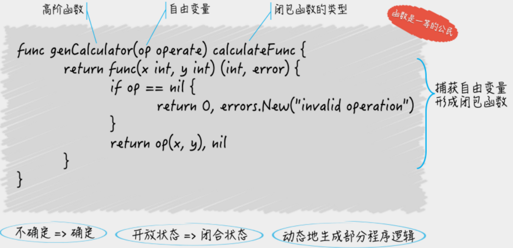

# 6 程序实体的那些事儿
# 类型判断

[demo](./04~06%20程序实体哪些事/src/artical6/q1.go)
- getElement: 接收类型、判断类型、后对不同类型处理不同行为

# 10 通道的基本操作
1. `c1 := make(chan int, 1)` 创建并发安全FIFO数据结构
    - `c1 <- 1` 存数据
    - `elem, ok := <- c1` 取数据，ok安全取数据， ok=false证明通道关闭且没有数据
2. `var c2 chan int` 作为并发的同步信号
    - `c2 <- 1` 发起信号，等待
    - `elem, ok := <- c2` 接收信号
3. close(c) 关闭通道

# 12 高级函数
## 12.1 闭包
[demo](./12%20高级函数/Closure.go)
需注意闭包的自由变量，自由变量在函数运行时才能确定其逻辑。

## 12.2 值与引用在函数中的传递
[demo](./12%20高级函数/value_and_reference.go)
值类型 | 引用类型
---|---
数组 ([3]int{1,2,3})  | 切片 ([]int{1,2,3})
int | 字典
string | 通道
bool | 字典
uint | 函数
float | 指针

规则：
- 值类型会在参数传递中直接拷贝底层数组，函数内修改不会影响外部数据
- 引用类型在参数传递一般是指针拷贝，使用`[]`操作可以修改底层数组，进而影响外部数据