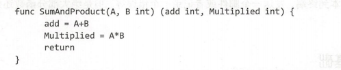
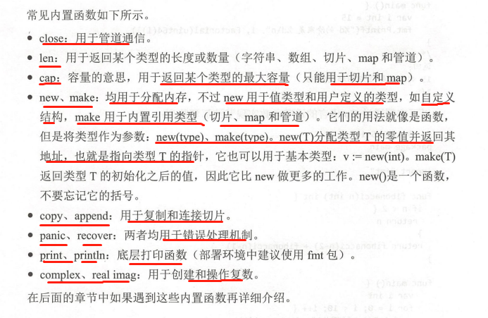
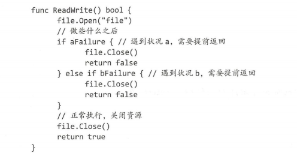
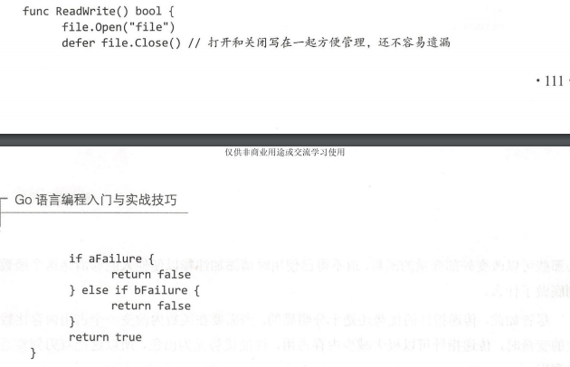

# 函数
main函数，它是程序的入口，因为Go是编译型语言，所以函数编写的顺序是无关紧要的
但为了可读性，最好把main()函数写在文件的前面。

# 一 认识函数
## 1.1 函数的声明
- **函数名称小写开头，作用域只属于所声明的包，不能被其他包调用；**
- **函数名称大写开头，函数公开，可被其他包调用，此方法适用于所有变量，函数等实体对象的声明。**
- Go函数不支持嵌套，重载和默认参数
- 声明只需要函数名与函数签名`func hello(str,num int)`
- 使用type
```go
func funcName(input1 type1 , input2 type2)(output1 type1,output2 type2){
    //逻辑代码
    
    return value1,value2 
}
```

## 1.2 参数
## 1.3 返回值

# 二 函数的基础
## 2.1 多返回值
没用过的特色



## 2.2 函数作为参数 
[demo](./Demo/Function-as-parameter-or-type.go)

## 2.3 函数作为类型
[demo](./Demo/Function-as-parameter-or-type.go)
- 函数是一种变量，类型就是所有拥有相同参数与相同返回值的一种函数类型

## 2.4 可变参数
[demo](./Demo/variable-parameter.go)
- 处理变长的参数，而这个长度可以是0
- 这里的arg是一个int类型的切换slice,可通过for range迭代
`func myfunc(arg ...int)`
- **而可变参数的原型应该是`arg...type`,本质上是一个数组切片，也就是`[]type`，可用for循环**
- 如果传递任意类型，那么就是 `arg ...interface{}`

## 2.5匿名函数和闭包
[demo](./Demo/Anonymous-functions-and-closures.go)

### 匿名函数
- 匿名函数不能独立存在，但可以赋值给其他变量
```go
fplus := func(x,y int) int {return x+y}

fplus(3,4)
```
- demo中对匿名函数创建直接调用

### 闭包
闭包允许调用定义在其他环境下的变量，使得某个函数捕捉到一些外部状态，例如函数被创建
时的状态。

专业语言就是：闭包继承了函数声明时的作用域。经常用来包装函数


## 2.6 递归函数
Go支持递归，但需要设置退出条件，否则会陷入死循环中

## 2.7 内置函数
直接获得编译器的支持，例如：len,cap,append,panic



# 三 函数进阶
## 3.1 参数传递机制
分 按值传递 和 按引用传递（使用指针）

传指针的三大好处：
- 1 传指针使多个函数能操作同一个对象
- 2 指针轻量8B
- 3 需要注意,Go中channel,slice,map三类实现机制类似指针，可以直接传递，而不用取地址后传递指针
- 4 赋予函数可修改外部变量的能力


## 3.2 defer与跟踪
1. defer的用途，IO错误，可方便关闭资源
    - 一般写法，代码重复严重
    - 
    - Go写法，优雅简洁
    - 
2. 执行顺序，defer,return,返回值 [demo](./Demo/defer.go)
    - 注意有名/无名返回值的区别
    - defer1继承defer2语句的值
    - return最先给返回值赋值；接着defer开始执行收尾工作；最后RET指令携带返回值退出函数
3. 用于跟踪函数压栈出栈
    [demo](./Demo/defer.go)

## 3.3 错误与恢复
```go
func panic(interface{})
func recover() interface {}
```

### 1. error 错误
[demo](./Demo/error.go)
Go通过error接口实现错误处理的便准模式
```go
type error interface{
    Error() string
}
```
使用：
```go
fun Foo(param int)(n int,err error){
    // ...
}


func main(){
    n,err := Foo(0)
    if err != nil{
        //错误处理
    } else {
        // 使用返回值n
    }
}

```
自定义error类型，定义一个类型，承载错误信息
- 第一步创建一个自定义类型
```go
type PathError struct{
    Op string
    Path string
    Err error
```
- 第二步，注册
```go
func (e *PathError) Error() string{
	return e.Op + " " + e.Path + ":" + e.Err.Error()
}
```

### 2.panic
[demo](./Demo/panic-recover.go)
函数调用panic函数的执行会中断，像exception一样
- panic()函数接受任意类型的数据
- panic()不会影响defer的执行

### 3.recover
[demo](./Demo/panic-recover.go)
- 让进入goroutine流程中恢复过来
- 只能在defer中的匿名函数中才能生效