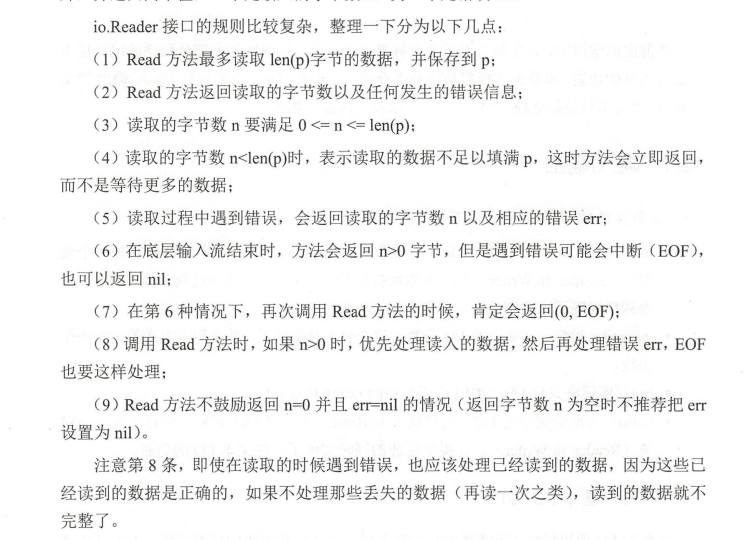
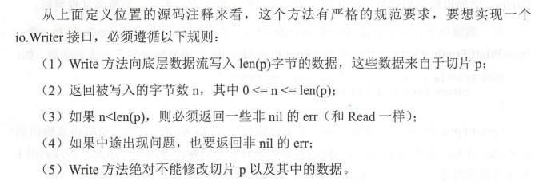
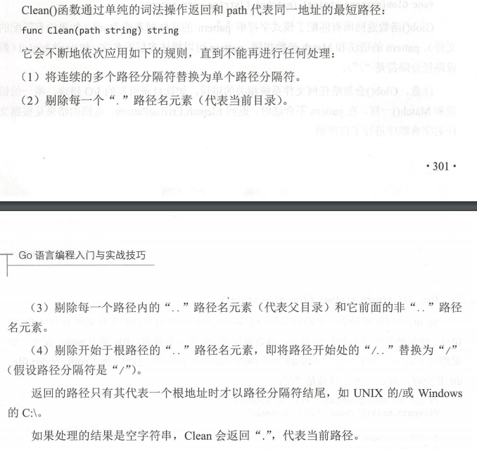

#  输入/输出
I/O操作封装在下面几个包
- io: 为I/O原语提供基本的接口，在io包中最重要的是两个接口——Reader和Writer接口
- io/ioutil: 封装了一些使用的I/O函数，这个包主要提供了一些常用，方便的I/O操作函数
- fmt：实现格式化I/O
- bufio：实现带缓冲的I/O


# 一 io
## 1 Reader接口
[demo](./Demo/io-Reader.go)
```go
type Reader interface{
    Read(p []byte)(n int, err error)
}

```
Reader接口的规范



## 2 Writer接口
实现Writer接口的规范


# 二 fmt
## 2.1 Print序列函数
Print
- Fprint/Fprintf/Fprintln
    ```go
    func Print(a ...interfaces{})(n int,err error){
        return Fprint(os.Stdout, a...)
    }
    ```
- Sprint/Sprintf/Sprintln
    - 连接字符串：`result := fmt.Sprint("example.com",2017)` result现在是example.com2017
- print/printf/println

## 2.2 Stringer接口
对任意struct实现，Stringer接口，在`fmt.Println(struct)`时，会调用该接口

## 2.3 Formatter接口
跟printf对接，自定义输出格式

## 2.4 GoStringer接口
用于打印Printf格式化占位符为 %#v的值

## 2.5 Scan
- Fscan/Fscanf/Fscanln
- Sscan/Sscanf/Sscanln
- Scan/Scanf/Scanln
    ```go
    func Scan(a ...interfaces{})(n int,err error){
        return Fscan(os.Stdin, a...)
    }
    ```
  
## 文本处理
strings：字符串操作
- vbytes:byte slice便利操作，在Go语言中string是内置类型
- strconv:字符串和基本数据类型之间转换
- regexp：正则表达式
- unicode：Unicode编码，UTF-8/16编码


# 三 文件系统
系统功能实现，需要syscall获取,我们应该优先使用os，而不是syscall
```go
file,err := os.Open("file.go")
if err != nil{
    log.Fatal(err)
}
```

## 3.1 path
1. 解析路径名字符串
    - Dir(),Base()
    - 例子：/home/zuolan/example.go, dir()=/home/zuolan , base()=example.go
    - /home/zuolan/example/ , dir()=/home/zuolan/example,base()=example
    
2. 相对路径，绝对路径
    - IsAbs(), Abs()返回决定路径
    - Rel()函数返回一个相对路径
    - Join(basepath,Rel(basepath,targpath)) = targpath
3. 路径的切分和拼接
    - Split()根据路径分隔符进行切分
    - Join()拼接路径总是使用Join，结果经过了Clean()
    - 分割PATH或GOPATH环境变量， `func SplitList(path string) []string` 就是这个用途
4. 规整化路径
    - 
5. 文件路径匹配
    - Match() 文件路径匹配
    - Glob()  某个目录下所有类型文件
6. 遍历目录
    - Walk() 遍历目录树
    