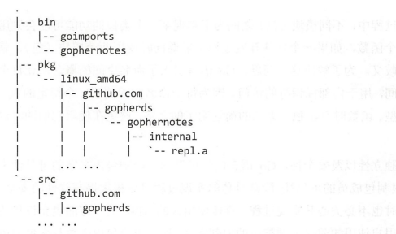
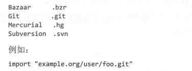
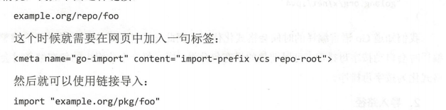
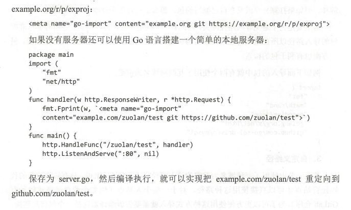

# 包
Go有一百多个标准库，使用 `Go Walker`查看，或者使用 `go list std`
- 包结构认识
- 包的使用基础
- 常用标准包详解
- 使用自定义包

# 一 包的基础
- 降低项目模块之间的耦合度，提高整体开发效率
- 避免冲突，引入命名空间
- 安全性：限制包成员的可见性提高软件的安全性。只允许用户通过特定的函数来访问和控制包内部的变量

Go编译速度快速
- 显示声明：所有导入包必须在每个文件的开头显示声明
- 无环依赖：禁止包的环状依赖，每个包被独立编译
- 无须遍历：目标文件记录包本身导出信息，记录包的依赖关系

## 1.1 包的结构
每个workspace必须由bin,pkg,src三个目录组成。
- bin：存放可执行文件
- pkg：存放编译好的库文件,主要是*.a文件
- src：存放Go语言的源文件


1. 工作空间
    - GOROOT：全局唯一变量，指定存放Go语言本身的目录路径
    - GOPATH：工作空间的变量，可有很多个
    - 通常使用第一个工作空间保存下载的第三方库，不管哪一个工作空间下载的包都可以在任意工作空间使用
2. 包的源文件
    - 一致使用package<name>语句进行声明
    - Go包由多个文件组成，文件名不需要与包名一致，包名小写字符，与所在目录，编译文件名无关
    - 可执行文件必须包含package main以及入口函数main
    - 变量命名大写，public。变量命名小写，internal
3. 包的声明
    主要用于源文件编译时能够为编译器指明哪些是包的源代码

## 1.2 包的导入
import "相对目录/包主文件名"
- 相对目录是指从/pkg/开始的子目录


1. 导入声明重命名
    - 注意：Go不允许导入不用，除非import _
    - 解决包名冲突，包名过长的问题
    ```go
    import "crypto/rand"    rand.function
    import R "crypto/rand"  重命名R R.function
    import . "crypto/rand"  简便模式 Function
    import _ "crypto/rand"  匿名导入 仅让该包执行初始化函数
    ```
2. 子包导入以及自定义路径导入包方式
[demo](./Demo/test.go)
3. 导入路径
    - 所有非标准库包的导入路径以所在组织的互联网域名为前缀
    ```go
        import(
            "golang.org/x/net/html"
            "github.com/go-sql-driver/mysql"
        )
    ```
4. 自定义路径
   - 对于企业自己搭建的私人GitLab仓库，需要告诉编译器这是一个包代码链接，三种方式实现：
        - 第一种:直接在包链接中加入VCS格式，目前支持
        - 第二种：针对没有提供版本控制符的链接，go get 甚至不知道应该如何下载代码
        - 第三种：重定向网页链接
5. 匿名导入
    - 只是为了导入包的变量初始化和执行导入包的init初始化函数，_抑制编译错误

## 1.3 包的使用
[demo](./Demo/test.go)
- 在 $GOPATH$/src/下面创建自己的包：目录+目录下的文件
- 在 `go build` `go install` 安装这个包

## 1.4 Go语言工具箱
1. 包文档
    - 包的整体注释，写在package前的一个注释块，提供包的整体信息
    - go doc生成的关于包的页面上，相关信息一并显示 `godoc -http:8000`
2. 内部包
    - 对一些包公开，对一些包不可见，引入内部包internal
    - internal只在子目录可见，其他不可见
3. 查询包

## 1.5 包的下载
```shell script
go get github.com/BurntSushi/toml
```

# 二 自定义包
## 2.1 包的制作
## 2.2 godoc生成文档
## 2.3 包的打包与发布
- Go.rice
- Statik

# 三 包的管理go.mod *
## 3.1直接使用go.mod
### 3.1.1 创建 
在GOPATH 目录之外新建一个目录，并使用go mod init 初始化生成go.mod 文件
```shell script
➜  ~ mkdir hello
➜  ~ cd hello
➜  hello go mod init hello
go: creating new go.mod: module hello
➜  hello ls
go.mod
➜  hello cat go.mod
module hello

go 1.12

```
>go.mod文件一旦创建后，它的内容将会被go toolchain全面掌控。go toolchain会在各类命令执行时，比如go get、go build、go mod等修改和维护go.mod文件。

go.mod 提供了module, require、replace和exclude 四个命令
- module 语句指定包的名字（路径）
- require 语句指定的依赖项模块
- replace 语句可以替换依赖项模块
- exclude 语句可以忽略依赖项模块

### 3.1.2 添加依赖
新建一个 server.go 文件，写入以下代码：
```go
package main

import (
	"net/http"
	
	"github.com/labstack/echo"
)

func main() {
	e := echo.New()
	e.GET("/", func(c echo.Context) error {
		return c.String(http.StatusOK, "Hello, World!")
	})
	e.Logger.Fatal(e.Start(":1323"))
}

```
执行 go run server.go 运行代码会发现 go mod 会自动查找依赖自动下载：
```shell script
PS D:\resource\go_programmer\hello> go run .\server.go
go: finding module for package github.com/labstack/echo
go: downloading github.com/labstack/echo v1.4.4
go: downloading github.com/labstack/echo v3.3.10+incompatible
go: found github.com/labstack/echo in github.com/labstack/echo v3.3.10+incompatible
go: finding module for package golang.org/x/crypto/acme/autocert
go: finding module for package github.com/labstack/gommon/log
go: downloading golang.org/x/crypto v0.0.0-20200728195943-123391ffb6de
go: downloading github.com/labstack/gommon v0.3.0
go: finding module for package github.com/labstack/gommon/color
go: found github.com/labstack/gommon/color in github.com/labstack/gommon v0.3.0
go: found golang.org/x/crypto/acme/autocert in golang.org/x/crypto v0.0.0-20200728195943-123391ffb6de
go: downloading github.com/mattn/go-colorable v0.1.2
go: downloading github.com/valyala/fasttemplate v1.0.1
go: downloading github.com/mattn/go-isatty v0.0.9
go: downloading golang.org/x/net v0.0.0-20190404232315-eb5bcb51f2a3
go: downloading github.com/valyala/bytebufferpool v1.0.0
go: downloading golang.org/x/text v0.3.0

   ____    __
  / __/___/ /  ___
 / _// __/ _ \/ _ \
/___/\__/_//_/\___/ v3.3.10-dev
High performance, minimalist Go web framework
https://echo.labstack.com
____________________________________O/_______
                                    O\
⇨ http server started on [::]:1323

```
现在查看go.mod 内容
```shell script
module hello

go 1.14

require (
	github.com/labstack/echo v3.3.10+incompatible // indirect
	github.com/labstack/gommon v0.3.0 // indirect
	golang.org/x/crypto v0.0.0-20200728195943-123391ffb6de // indirect
)

```
go module 安装 package 的原則是先拉最新的 release tag，若无tag则拉最新的commit，详见 [Modules官方介绍](https://github.com/golang/go/wiki/Modules) 。 go 会自动生成一个 go.sum 文件来记录 dependency tree：
```shell script
$ cat go.sum
github.com/labstack/echo v3.3.10+incompatible h1:pGRcYk231ExFAyoAjAfD85kQzRJCRI8bbnE7CX5OEgg=
github.com/labstack/echo v3.3.10+incompatible/go.mod h1:0INS7j/VjnFxD4E2wkz67b8cVwCLbBmJyDaka6Cmk1s=
github.com/labstack/gommon v0.2.8 h1:JvRqmeZcfrHC5u6uVleB4NxxNbzx6gpbJiQknDbKQu0=
github.com/labstack/gommon v0.2.8/go.mod h1:/tj9csK2iPSBvn+3NLM9e52usepMtrd5ilFYA+wQNJ4=
github.com/mattn/go-colorable v0.1.1 h1:G1f5SKeVxmagw/IyvzvtZE4Gybcc4Tr1tf7I8z0XgOg=
github.com/mattn/go-colorable v0.1.1/go.mod h1:FuOcm+DKB9mbwrcAfNl7/TZVBZ6rcnceauSikq3lYCQ=
... 省略很多行

```
### 3.1.3 
再次执行脚本 go run server.go 发现跳过了检查并安装依赖的步骤。

### 3.1.4 升级更新依赖
可以使用命令 go list -m -u all 来检查可以升级的package，使用go get -u need-upgrade-package 升级后会将新的依赖版本更新到go.mod * 也可以使用 go get -u 升级所有依赖

## 3.2 改造现有项目
项目结构
```shell script
$ tree
.
├── api
│   └── apis.go
└── server.go

1 directory, 2 files

```
server.go 源码为：
```go
package main

import (
    api "./api"  // 这里使用的是相对路径
    "github.com/labstack/echo"
)

func main() {
    e := echo.New()
    e.GET("/", api.HelloWorld)
    e.Logger.Fatal(e.Start(":1323"))
}

```

api/apis.go 源码为：
```go
package api

import (
    "net/http"

    "github.com/labstack/echo"
)

func HelloWorld(c echo.Context) error {
    return c.JSON(http.StatusOK, "hello world")
}

```
### 3.2.1 初始化
使用 go mod init *** 初始化go.mod
```shell script
$ go mod init helloworld
go: creating new go.mod: module helloworld

```
### 3.2.2 启动原有项目
运行 go run server.go
```shell script
go: finding github.com/labstack/gommon/color latest
go: finding github.com/labstack/gommon/log latest
go: finding golang.org/x/crypto/acme/autocert latest
go: finding golang.org/x/crypto/acme latest
go: finding golang.org/x/crypto latest
build command-line-arguments: cannot find module for path _/home/gs/helloworld/api
```
首先还是会查找并下载安装依赖，然后运行脚本 server.go，这里会抛出一个错误：
```shell script
build command-line-arguments: cannot find module for path _/home/gs/helloworld/api
```
但是go.mod 已经更新：
```shell script
$ cat go.mod
module helloworld

go 1.12

require (
        github.com/labstack/echo v3.3.10+incompatible // indirect
        github.com/labstack/gommon v0.2.8 // indirect
        github.com/mattn/go-colorable v0.1.1 // indirect
        github.com/mattn/go-isatty v0.0.7 // indirect
        github.com/valyala/fasttemplate v1.0.0 // indirect
        golang.org/x/crypto v0.0.0-20190313024323-a1f597ede03a // indirect
)

```
那为什么会抛出这个错误呢？

## 3.3 查看，更新，删除

除了 go run 命令以外，go build、go test 等命令也能自动下载相关依赖包。

```shell script
#移出所有代码中不需要的包
go mod tidy
#移除golang.org/x/crypto 包
go mod edit --droprequire=golang.org/x/crypto
#查看依赖包
go list -m all
#json 格式输出
go list -m -json all
#由于手动修改go.mod导致没有格式化
go mod edit -fmt
```

