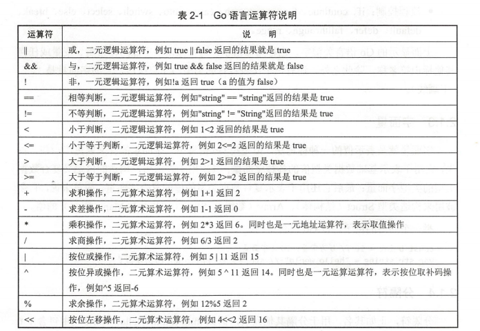
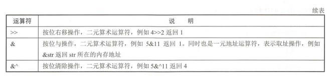
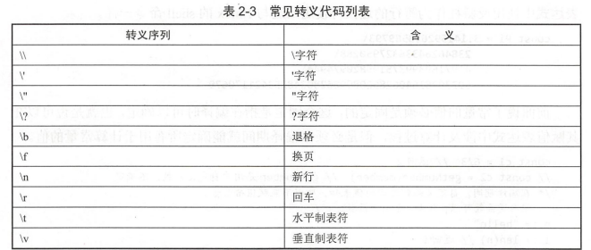

# 一 程序控制
1. 标识符 identifier
2. 关键字 keyword
3. 运算符 operator
4. 分隔符 delimiter
5. 字面量 literal

## 1.1 标识符
### 用户自定义标识符
例如：fmt.Println 表示使用 fmt包中的Println标识符

### 预定义标识符
- 数据类型：
    - bool,byte,
    - int,uint,int8,uint8,int16,uint16,int32,uint32,int64,uint64
    - string,uintptr
- 内建函数名：
    - append,cap,close,complex,copy,delete,imag,len,make,new,panic,print,println,real,recover
- 其他标识符：
    - iota
    - nil
    - _ （空标识符，用于变量声明与包的导入）因为Go要求存在实体必须使用
### 标识符要求
标识符以字母a~z（大小写均可）或下划线_开头，后面可以是多个字母，下划线和数字。

但Go区分大小写的编程语言，所以Test和test在Go语言程序表示不同的标识符


## 1.2 关键字
Go作为静态编译型语言，关键字一共有25个
- 包的导入与声明：import,package
- 程序实体声明与定义：var,type,func,interface,map,struct,chan,const
- 流程控制：if,continue,for,return,go,case,goto,switch,select,else,break,default,defer,fallthrough,range

## 1.3 字面量
表示值的一种标记法（常量）
- 用于表示基础数据类型值的各种字面量
- 用于表示用户构造的自定义复合数据类型的类型字面量
- 表示复合数据类型的值的复合字面量

## 1.4 分隔符
小数点，逗号，分号，冒号和省略号

## 1.5 运算符
**运算符**：
- 
- 

**优先级**：
- 
- 优先级相同，根据从左到右的顺序依次操纵。

## 1.6 注释
与C/C++相同,//,/**/

# 二 Go语言基础概念
## 2.1 常量 const
编译时就确定的值，禁止写权限
- 显示定义
- 隐式定义

示例代码：
- Demo/constant.go
- 长的字符串使用\转行

### 1.数字表示
- 前缀时0x或0X为十六进制
- 前缀是0的八进制
- 十进制

### 2.转义字符 \


### 3.赋值 :=
Demo/Assignment.go

### 4.枚举 consts
```cgo
const (
 Connected = 0
 Disconnected = 1
 Unknown = 2 
)
```
Demo/enum.go

## 2.2 变量 var
### 2.2.1 变量声明 var
声明格式是： var identifier type
- type放在了最后需要注意
- 单独定义`var a int`
- 批量定义
    ```
    var (
        a,b int
        c bool
        str string 
    )
    ```

也可动态声明：var identifier

### 2.2.2 局部变量声明 :=
`a := 1` 等价于 `var a = 1`
**这种方式只能用在函数体内,不能用于全局变量的声明与赋值**

注意事项：
- 同一个代码块内不能多次声明同一个变量
- 函数内部可以使用全局定义的变量
- 函数体内属于独立代码块，可以再次声明变量，可以改变变量类型，并且定义只在函数内部生效
- 如果在定义变量之前就调用该变量，那么会编译错误
- 全局定义不限制位置，但建议统一放在函数代码前面

未定义的默认值,所有变量需要初始化
- int:0
- float:0.0
- bool:false
- string:空字符串
- 指针：nil
- 没有指定类型：默认int,0

### 2.2.3 匿名变量
局部变量定义了必须使用,使用_更优雅

### 2.2.4 init函数
除了在全局声明初始化实体，也可以在init函数中初始化。
- init函数优先级比main高
- init不能手动调用
- 每一个源文件都有一个init函数
- 初始化过程会根据包的依赖关系顺序单线程执行
